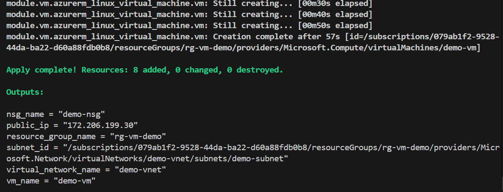
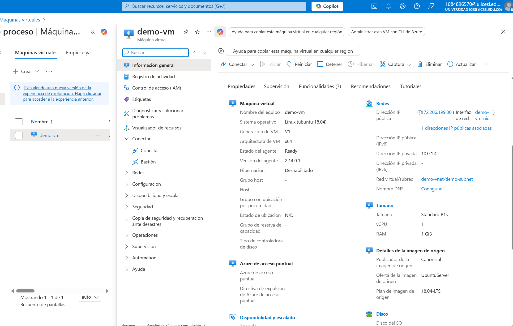
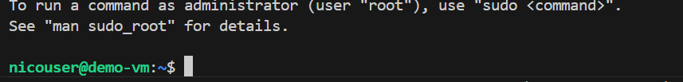

# Infraestructura Modular en Azure con Terraform

Este proyecto implementa una infraestructura modular en Azure utilizando Terraform, siguiendo las mejores prácticas de DevOps. La infraestructura se divide en módulos especializados que facilitan la reutilización, mantenimiento y escalabilidad del código.

## Arquitectura Modular

### Módulos Implementados

1. **Módulo de Red (`modules/network`)**
   - Gestiona la infraestructura de red
   - Implementa Virtual Network y Subnet
   - Configurable mediante variables para diferentes entornos
   - Outputs exponen IDs y nombres de recursos de red

2. **Módulo de Seguridad (`modules/security`)**
   - Maneja aspectos de seguridad de la infraestructura
   - Implementa Network Security Groups (NSG)
   - Reglas de seguridad configurables mediante variables
   - Soporta múltiples reglas de seguridad

3. **Módulo de VM (`modules/vm`)**
   - Gestiona recursos de máquinas virtuales
   - Maneja IP pública y NIC
   - Configuración flexible de imagen y tamaño de VM
   - Outputs para monitoreo y conexión

## Estructura del Proyecto

### Archivos Principales
```
.
├── main.tf              # Orquestación principal de módulos
├── variables.tf         # Variables globales del proyecto
├── outputs.tf          # Outputs consolidados
└── modules/
    ├── network/        # Módulo de red
    │   ├── main.tf
    │   ├── variables.tf
    │   └── outputs.tf
    ├── security/       # Módulo de seguridad
    │   ├── main.tf
    │   ├── variables.tf
    │   └── outputs.tf
    └── vm/            # Módulo de máquina virtual
        ├── main.tf
        ├── variables.tf
        └── outputs.tf
```

## Beneficios de la Modularización

1. **Reutilización de Código**
   - Módulos independientes y reutilizables
   - Reduce la duplicación de código
   - Facilita la implementación en diferentes entornos

2. **Mantenibilidad**
   - Separación clara de responsabilidades
   - Código más organizado y fácil de mantener
   - Actualizaciones más seguras y controladas

3. **Escalabilidad**
   - Fácil adición de nuevos módulos
   - Adaptable a diferentes requisitos
   - Soporte para múltiples entornos

4. **Seguridad**
   - Separación de aspectos de seguridad
   - Control granular de accesos y reglas
   - Variables sensibles marcadas apropiadamente

## Evidencias de Implementación
A continuación se muestran capturas del proceso:

### 1. Apply para la cuenta de Azure


### 2. Portal de Azure mostrando la VM creada


### 3. Conexión exitosa a la VM

