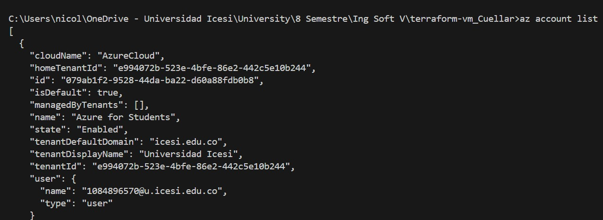
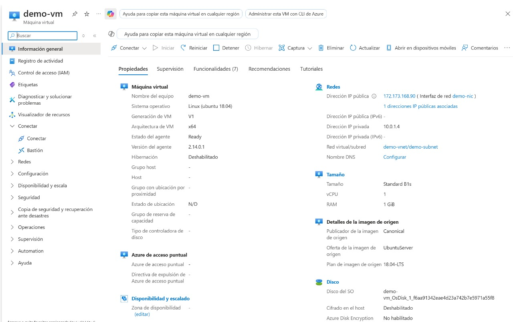
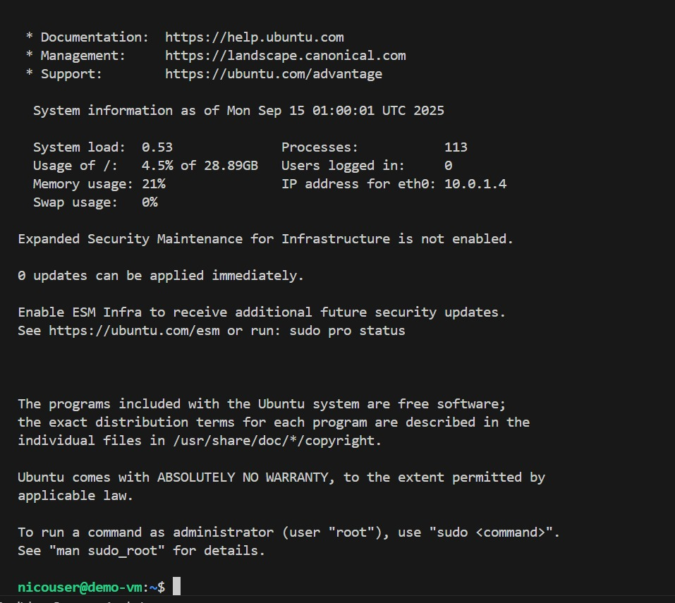
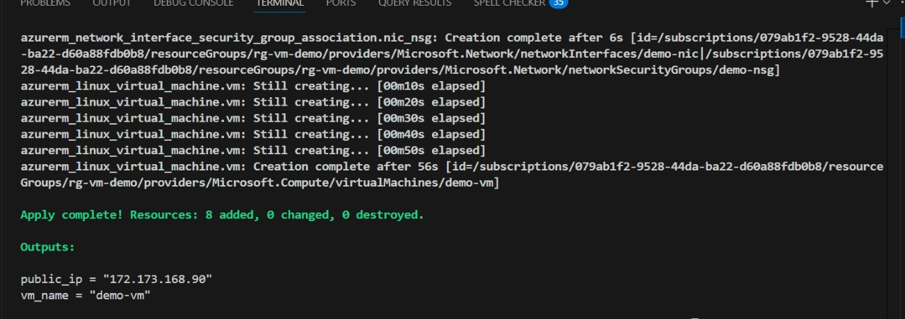

# Creación de Máquina Virtual en Azure con Terraform

Este proyecto utiliza Terraform para desplegar una máquina virtual (VM) Linux en Microsoft Azure de forma automatizada. Se configura la red, la seguridad y los recursos necesarios para que la VM sea accesible por SSH.

## ¿Qué se hizo?
- Se creó un grupo de recursos en Azure.
- Se configuró una red virtual, subred, IP pública y reglas de seguridad (NSG).
- Se desplegó una máquina virtual Ubuntu 18.04-LTS.
- Se verificó la conexión exitosa a la VM.
- Finalmente, se destruyó la infraestructura usando `terraform destroy`.

## Evidencias
A continuación se muestran capturas del proceso:

### 1. Visualización de la cuenta en Azure

### 2. Portal de Azure mostrando la VM creada

### 3. Conexión exitosa a la VM

### 4. Eliminación de la VM con Terraform Destroy

---

**Autor:** Nicolas Cuellar Molina - A00394970

